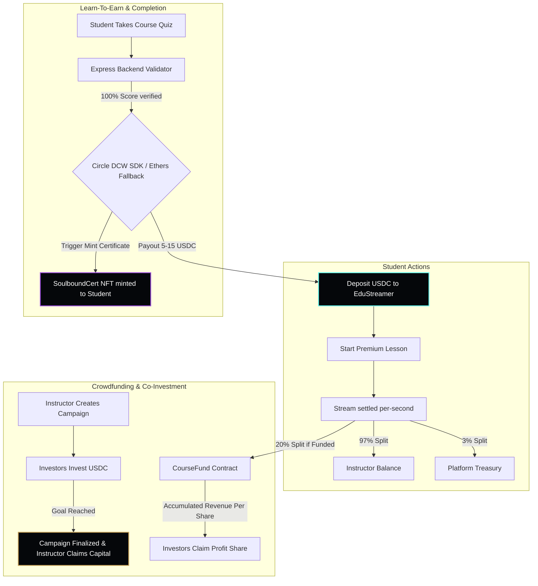

# 🎓 EduStream — Decentralized Pay-As-You-Learn Micro-Education Platform

EduStream is a revolutionary, decentralized **pay-as-you-learn micro-education platform** designed for the **Arc Testnet** (Circle's USDC-gas L1 blockchain). 

By replacing traditional Web2 subscription models with real-time on-chain payment streaming, automated **Learn-to-Earn (L2E)** micro-incentives powered by **Circle Developer-Controlled Wallets**, and non-transferable **Soulbound Token (SBT)** credentials, EduStream reshapes the economics of digital learning.

---

## 🌌 The Vision: Breaking Learning Friction
Traditional online education is bottlenecked by rigid financial commitments:
1. **Subscription Fatigue**: Users pay hefty monthly/annual fees for courses they rarely finish.
2. **Lack of Incentives**: Students struggle to remain motivated without direct, immediate feedback loops.
3. **Creator Funding Gaps**: Instructors lack fair, trustless crowdfunding models to finance premium content production.

**EduStream solves this with a three-sided ecosystem:**
* **Students** only pay for the exact seconds of educational content they consume.
* **Co-Investors** crowdfund new courses and earn a trustless, automated share of subsequent streaming revenue.
* **Achievers** are instantly rewarded with real-time USDC stablecoin payouts and Soulbound accomplishment badges.

---

## 🔗 Built on Arc Testnet (Circle's USDC-Gas L1)
EduStream leverages the unique capabilities of the **Arc L1 Blockchain**, providing:
* **Gas Paid in USDC**: Eliminates the UX hurdle of acquiring volatile native network tokens (like ETH, MATIC) to execute transactions. All contract interactions use USDC for gas!
* **Fast Settlement**: Near-instant block finality allows smooth, real-time starting, pausing, and settling of payment streams.
* **Circle Ecosystem Integration**: Native compliance, liquidity, and programmable transfer architectures.

---

## 🛠 Deployed Smart Contracts & Architecture

The EduStream network is composed of three highly optimized, interacting Solidity smart contracts:

| Contract | Address (Arc Testnet) | Description |
| :--- | :--- | :--- |
| **`EduStreamer.sol`** | [`0x9Cc210a5cACeE32536558c3cb1429839F6edaF72`](https://rpc.testnet.arc.network) | Manages student deposits, real-time per-second USDC streams, platform fees, and splits revenue. |
| **`CourseFund.sol`** | [`0x09db3acc9338374390B19CBA57C14Ba3E157C686`](https://rpc.testnet.arc.network) | Crowdfunds course production costs. Implements high-precision, loop-free *Accumulated Revenue Per Share* splits. |
| **`SoulboundCert.sol`**| [`0xC2ca8c8De4eaF237750a3560d99758A334109944`](https://rpc.testnet.arc.network) | Mints non-transferable completion certificates (Soulbound Tokens) to students upon quiz validation. |

### System Interaction Diagram


---

## ⚡ Core Features Implemented

### 1. Per-Second USDC Streamer (`EduStreamer.sol`)
* **Dynamic Micropayments**: Allows students to stream premium courses at custom per-second rates (e.g., `0.00055 USDC/sec` equivalent to `550 micro-units/sec`).
* **Instant Settlement**: Upon pausing or stopping a video, a single on-chain transaction deducts the streamed cost from the student's pre-funded deposit and routes it instantly.
* **On-Chain Splits**: Splits fee collection natively on-chain: **3%** to the platform treasury, **77%** to the instructor, and **20%** to course co-investors (if funded via `CourseFund`).

### 2. Scalable Course Co-Investment (`CourseFund.sol`)
* **Decentralized Production Funding**: Instructors raise production costs for premium syllabus content directly from the community.
* **Risk Mitigation via Refunds**: If a campaign fails to hit its funding goal before the block deadline, investors can withdraw 100% of their principal capital.
* **Loop-Free Distribution (O(1) Gas Complexity)**: 
  > [!TIP]
  > Traditional split contracts loop through arrays of investors, which scales in gas cost and risks reaching the block gas limit (causing permanent lock-ups).
  > `CourseFund` utilizes the **Accumulated Revenue Per Share** algorithm. Gas usage remains completely flat regardless of whether a course has 1 investor or 100,000 investors, eliminating looping vectors.

### 3. Learn-to-Earn (L2E) Reward Router (Backend API)
* **Immediate Gratification**: Students completing knowledge-check quizzes with a 100% score instantly trigger a **USDC stablecoin reward** (up to 15.00 USDC depending on course complexity).
* **Enterprise Wallet Infrastructure**: The backend integrates the **Circle Developer-Controlled Wallets API**, providing highly secure, scalable, and automated payouts.
* **Robust Resiliency**: Automatically falls back to a secure Ethers.js Admin Wallet engine on-chain if developer console variables are not configured in the host environment.

### 4. Onchain Soulbound Certificates (`SoulboundCert.sol`)
* **Verifiable Accomplishments**: Non-transferable ERC-721 credentials representing course mastery.
* **Anti-Collusion / Transfer Blocked**: Overridden standard `transferFrom` and `safeTransferFrom` functions revert automatically, tying credentials permanently to the student's sovereign address.
* **Rich Metadata Storage**: Packages structural details including course ID, name, student address, and timestamp directly in the token URI mapping.

---

## 🛠 Technology Stack
* **Smart Contracts**: Solidity `v0.8.24` (compiled under the `Cancun` EVM spec), Hardhat, OpenZeppelin.
* **Backend Engine**: Node.js, Express, Circle Developer-Controlled Wallets SDK, Ethers.js v6.
* **Frontend Dashboard**: React 18, Vite, TypeScript, WAGMI v2, RainbowKit v2, Tailwind-free custom CSS Cyber-Cyan styling.

---

## 🚀 Quick Start Guide

### 📋 Prerequisites
* [Node.js](https://nodejs.org/) v18+
* [NPM](https://www.npmjs.com/)
* A wallet configured with **Arc Testnet** and funded with **USDC Testnet gas tokens**.

### 1. Repository Setup & Smart Contract Compilation
Clone and install the workspace dependencies:
```bash
# Clone the repository
git clone <repo-url>
cd EduStream

# Install hardhat & root workspace dependencies
npm install

# Compile the solidity smart contracts
npm run compile
```

### 2. Deployed Contract Verification
Contracts are already fully deployed and linked on the Arc Testnet. If you want to redeploy your own instances:

1. Create a `.env` file at the project root:
   ```env
   PRIVATE_KEY="your_private_key_with_usdc_on_arc"
   ```
2. Deploy to the Arc Network:
   ```bash
   npm run deploy
   ```
3. Update the outputs in:
   * **Backend**: `server/index.js` (`SOULBOUND_CERT_ADDRESS`)
   * **Frontend**: `client/src/config.ts` (`COURSE_FUND_ADDRESS`, `EDU_STREAMER_ADDRESS`, `SOULBOUND_CERT_ADDRESS`)

---

### 3. Launching the L2E Rewards Backend Server
The server handles automated Circle DCW stablecoin distributions and mints Soulbound Certs on behalf of the validator authority.

1. Configure your `.env` file at the root to include optional Circle Developer API details:
   ```env
   PRIVATE_KEY="your_private_key_on_arc"
   CIRCLE_API_KEY="your_circle_developer_api_key"
   CIRCLE_ENTITY_SECRET="your_entity_secret"
   CIRCLE_DEVELOPER_WALLET_ID="your_developer_controlled_wallet_uuid"
   ```
   > [!NOTE]
   > If Circle keys are omitted, the engine automatically defaults to standard **Ethers EOA on-chain transactions** to fulfill payouts seamlessly.

2. Start the backend:
   ```bash
   npm run server
   ```
   *The server will boot on `http://localhost:3001`.*

---

### 4. Running the Cyberpunk Frontend Dashboard
1. Change into the `client` directory:
   ```bash
   cd client
   ```
2. Install client dependencies:
   ```bash
   npm install
   ```
3. Start the Vite React development server:
   ```bash
   npm run dev
   ```
4. Open your browser to [http://localhost:5173](http://localhost:5173) and connect your wallet!

---

## 🎨 Premium Visual Palette & UX Details

The frontend interface breaks away from standard, boring dashboard layouts to deliver an immersive, futuristic environment:
* **Cyberpunk Aesthetics**: Features deep dark-space backdrops (`#05070a`), neon cyan accents (`#66fcf1`), golden crown overlays (`#c5a059`), and ambient purple glows.
* **Micro-Animations**: Real-time payment ticker streams dynamically on-screen as lesson seconds increment, showing students exactly where their capital is flowing.
* **Frictionless Interactions**: Simple controls to pause/resume lessons, deposit USDC, inspect current co-investment goals, and take course validation quizzes.

---

## ⚖ License
EduStream is licensed under the **MIT License**. See `LICENSE` for details.
